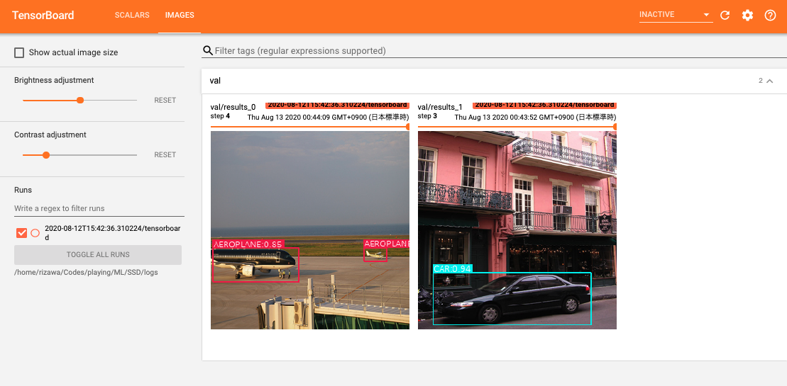

# SSD: Single Shot MultiBox Object Detector in pytorch
This is a pytorch implementation of Single Shot MultiBox Object Detector in pytorch.  

(Reference)  
https://github.com/amdegroot/ssd.pytorch  
https://github.com/YutaroOgawa/pytorch_advanced/tree/master/2_objectdetection  
https://github.com/sgrvinod/a-PyTorch-Tutorial-to-Object-Detection

## Requirements
```bash
$ pip install -r requirements.txt
```

## Usage
### Configs
Create a configuration file based on configs/default.yaml.
```bash
# ----------
# dataset
# ----------
data_root: ./dataset/
n_classes: 21
classes: ['aeroplane', 'bicycle', 'bird', 'boat',
          'bottle', 'bus', 'car', 'cat', 'chair',
          'cow', 'diningtable', 'dog', 'horse',
          'motorbike', 'person', 'pottedplant',
          'sheep', 'sofa', 'train', 'tvmonitor']
img_size: 300
n_channels: 3
color_mean: [104, 117, 123]
train_txt: train.txt
test_txt: val.txt

# ----------------
# train parameters
# ----------------
lr: 0.0001
decay: 1e-4
n_gpus: 1 # currently works with only one gpu
batch_size: 64
n_epochs: 50
jaccord_thresh: 0.5
neg_pos: 3

# pretrained path: vgg16 model path or blank
pretrained: ./weights/vgg16_reducedfc.pth

# ssd configs
bbox_aspect_num: [4, 6, 6, 6, 4, 4]  # number of aspect ratios of dbox
feature_maps: [38, 19, 10, 5, 3, 1]  # feature map size of each source
steps: [8, 16, 32, 64, 100, 300]  # size of dbox
min_sizes: [30, 60, 111, 162, 213, 264]  # size of dbox
max_sizes: [60, 111, 162, 213, 264, 315]  # size of dbox
aspect_ratios: [[2], [2, 3], [2, 3], [2, 3], [2], [2]] # aspect ratios
variances: [0.1, 0.2] # variances for decode
conf_thresh: 0.01
top_k: 200
nms_thresh: 0.45

# metric configs
confidence_level: 0.5

# save_ckpt_interval should not be 0.
save_ckpt_interval: 50

# output dir (logs, results)
log_dir: ./logs/

# checkpoint path or blank
resume: ./weights/ssd300_mAP_77.43_v2.pth
# e.g) resume: ./logs/2020-07-26T00:19:34.918002/ckpt/best_acc_ckpt.pth

# visualize label color_map
label_color_map: ['#e6194b', '#3cb44b', '#ffe119', '#0082c8', '#f58231', '#911eb4', '#46f0f0', '#f032e6',
                   '#d2f53c', '#fabebe', '#008080', '#000080', '#aa6e28', '#fffac8', '#800000', '#aaffc3', '#808000',
                   '#ffd8b1', '#e6beff', '#808080', '#FFFFFF']
# font should be downloaded manually
font_path: ./font/calibril.ttf
```

### Prepare Dataset
If you want to use your own dataset, you need to prepare a directory with the following structure:
```bash
datasets/
├── annotations
│   ├── hoge.xml
│   ├── fuga.xml
│   ├── foo.xml
│   └── bar.xml
├── images
│   ├── hoge.jpg
│   ├── fuga.jpg
│   ├── foo.jpg
│   └── bar.jpg
├── train.csv
└── test.csv
```

The content of the txt file should have the following structure.
```bash
hoge
fuga
foo
bar
```

An example of a custom dataset can be found in the dataset folder.

### Train
```bash
$ python main.py --config ./configs/default.yaml
```

### Inference
```bash
$ python main.py --config ./configs/default.yaml --inference
```

### Tensorboard
```bash
tensorboard --logdir={log_dir} --port={your port}
```


## Output
You will see the following output in the log directory specified in the Config file.
```bash
# Train
logs/
└── 2020-07-26T14:21:39.251571
    ├── checkpoint
    │   ├── best_acc_ckpt.pth
    │   ├── epoch0000_ckpt.pth
    │   └── epoch0001_ckpt.pth
    ├── metrics
    │   └── train_metrics.csv 
    │   └── test_metrics.csv 
    ├── tensorboard
    │   └── events.out.tfevents.1595773266.c47f841682de
    └── logfile.log

# Inference
inference_logs/
└── 2020-07-26T14:21:06.197407
    ├── images
    │   ├── hoge.jpg
    │   └── fuga.csv 
    ├── metrics
    │   └── test_metrics.csv 
    ├── tensorboard
    │   └── events.out.tfevents.1595773266.c47f841682de
    └── logfile.log
```

The contents of train_metrics.csv and test_metrics.csv look like as follows:
```bash
epoch, train loss, train mean iou
0,3.8158764839172363,0.2572
1,3.4702939987182617,0.1169
```
You can monitor loss, iou per class and mean iou in the logfile during training.
